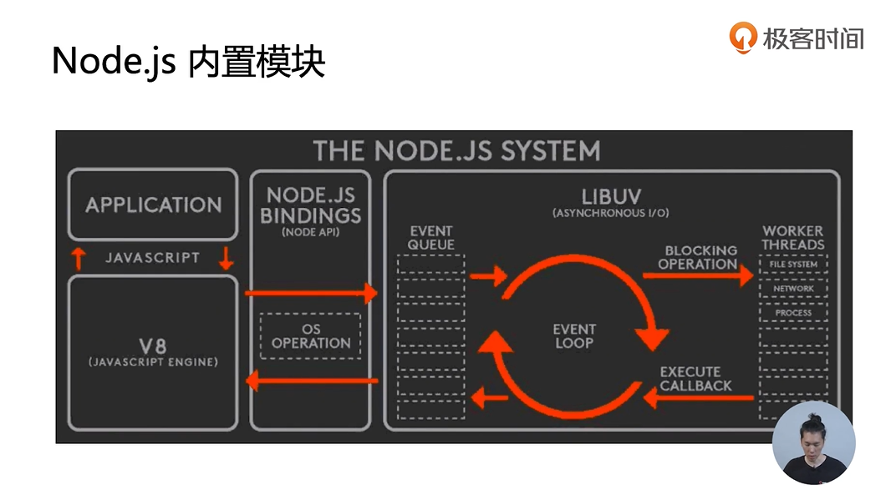
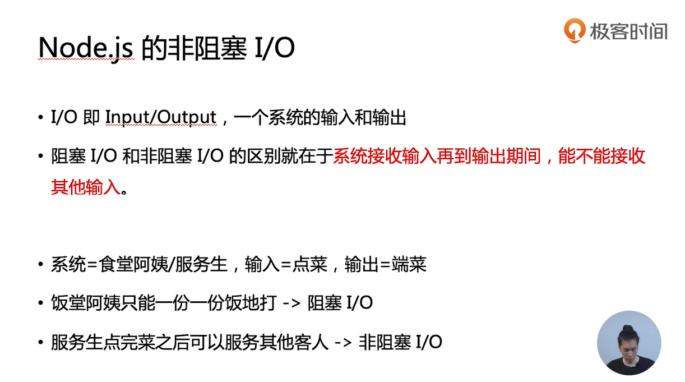
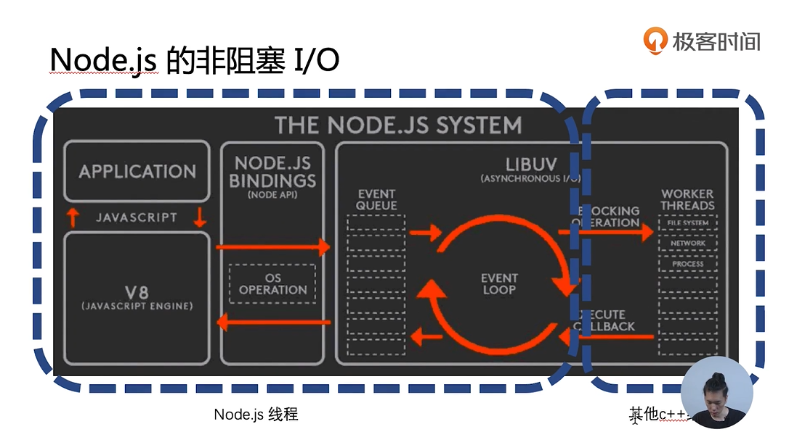
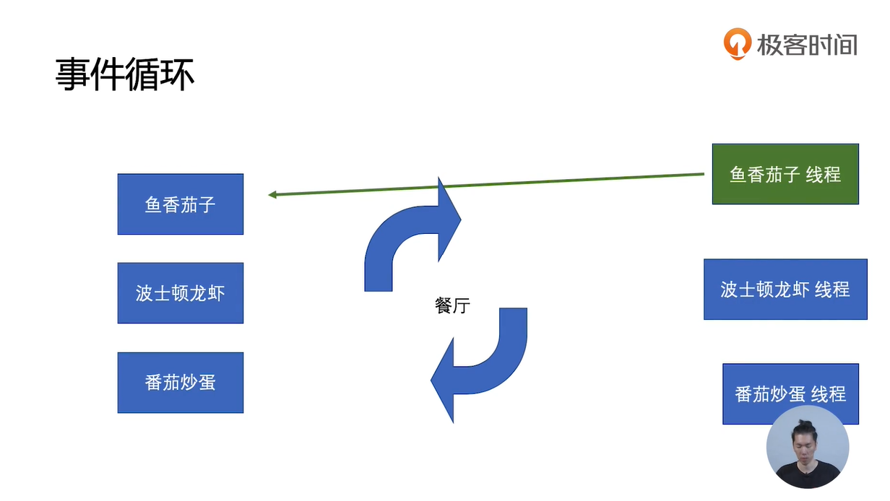
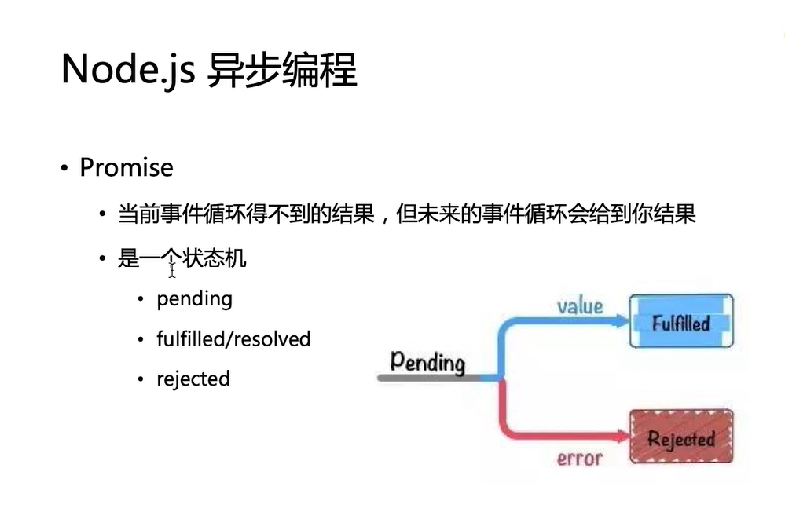

## Node环境安装
1. 下载安装包
2. 配置环境变量PATH


## 第一个Node程序
``` js
process.stdin('data',e=>{
    console.log(e.toString().trim())
})
```

## CommonJs规范

可以导出多个属性：变量、函数、对象等
`exports.name = 'lib'`
`exports.add = function(){}`
`exports.obj = {msg:'hello'}`

module.exports会覆盖之前exports，具体原理可以查看webpack打包后的文件
`module.exports = {}`

通过require导入的是对象的**引用**
`cont lib = require('./lib.js')`

## npm包管理工具

声明当前项目为npm包
`npm init -y`

安装第三方npm包
`npm install 包名`

下载**package.json**中所有依赖的包
`npm install`
这样就可以删除**node_modules**文件夹，减小项目体积，方便传输

卸载npm包
`npm uninstall 包名`

npm是国外镜像下载速度比较慢，可以使用淘宝镜像cnpm来提高下载速度
全局安装cnpm
`npm install -g cnpm --registry=https://registry.npm.taobao.org`

cnpm使用方法和npm保持一致，只需使用指令**cnpm**
`cnpm install 包名`

## 内置模块

nodejs是基于JavaScript V8引擎运行的。
nodejs提供了许多内置模块来处理应用层面和操作系统层面间的通信

例子：events模块
- 观察者模式
- 调用vs抛事件
    - 关键在于“不知道被通知者存在”
    - 以及"没有人听还能继续下去"

解决两个对象间的通信问题
``` js
const EventEmitter = require('events')
class Geektime extends EventEmitter{
    constructor(){
        super()
        setInterval(() => {
            this.emit('newLesson',{price:Math.random()*100})
        }, 3000);
    }
}
// geektime被通知者
const geektime = new Geektime()
geektime.addListener('newLesson',(res)=>{
    console.log('year',res)
})
```

## Node.js的非阻塞I/O
阻塞和非阻塞的区别在于**系统接收输入再到输出时间，能不能接收其他输入**


非阻塞I/O底层确实是用多线程实现的。只是线程不被暴露出来给开发者控制


nodejs线程把阻塞操作交给c++线程完成，等到c++线程把这些计算都执行完毕后，再把结果回调到nodejs线程


## 异步编程callback

回调函数案例
``` js
interview(function(error,data){
    if(error){
        console.error(error)
    }else{
        console.log('smile',data) 
    }
})

function interview(callback){
    setTimeout(() => {
        callback(null,'success')
    }, 500);
}
```
- 回调函数格式规范
  - error-first
  - Node-style
- 第一个参数是error，后面的参数才是结果

由于callback回调函数会改变函数调用栈，导致**try catch**无法捕捉到错误信息，因此在回调函数中需要将第一个参数设置为**error**，以便捕获到错误，不使整个nodejs程序崩溃

## 事件循环Event Loop



当nodeJs遇到阻塞I/O事件时，会交付给事件循环。由c++线程执行阻塞操作，底层使用了不同操作系统的多线程方案，来完成多个I/O操作。
当阻塞事件完成时，会发送callback消息给事件队列Event Queue。NodeJs会不断检查队列是否有待执行的callback消息，如果有就执行队列里所有的callback

下面是一个event loop机制的简单实现

``` js
const eventloop = {
    queue:[],
    loop(){
        while(this.queue.length){
            var callback = this.queue.shift()
            callback()
        }
        setTimeout(this.loop.bind(this), 50);
    },
    add(callback){
        this.queue.push(callback)
    }
}

// 开启事件循环，检查队列是否有待执行回调函数
eventloop.loop()


// setTimeout可以模拟阻塞I/O，如文件读取等
// 阻塞事件完成后，向队列发送callback消息
setTimeout(() => {
   eventloop.add(function(){
       console.log('1')
   }) 
}, 500);
setTimeout(() => {
    eventloop.add(function(){
        console.log('2')
    }) 
 }, 1000);
```

## Promise

在chrome执行下面这段代码
``` js
(function(){
    var promise = new Promise(function(resolve,reject){
        setTimeout(() => {
            resolve("success")
        }, 500);

        // resolved状态无法跳转到rejected状态，所以无法被执行
        // reject(new Error('fail'))
    })
    .then(function(res){
        console.log(res)
    })
    .catch(function(err){
        console.log(err)
    })
    
    setTimeout(() => {
        console.log(promise)
    }, 800);
    
}())
```
.thne和.catch相当于向任务消息队列发布一个待执行callback消息
当Promise内部的异步/阻塞事件完成后，会查看消息队列是否有callback，如果有则执行队列里的callback回调函数。resolve()和rejece()就是去负责执行队列的callback

**.then 和 .catch**
- resolved状态的promise会回调后面第一个 .then
- rejected状态的promise会回调后面第一个 .catch
- 任何一个rejected状态且后面没有.catch的promise，都会造成浏览器/Node环境的全局错误


**Promise其实和callback并没有太大差别，但是写法更复杂，那么它优秀的地方在哪里？**
``` js
(function(){
    var promise = new Promise(function(resolve,reject){
        setTimeout(() => {
            resolve("success")
        }, 500);
    })

    var promise1 = promise.then((res) => {
        throw new Error()
    })
    
    setTimeout(() => {
        console.log(promise)  // Promise <resolved>
        console.log(promise1) // Promise <rejected>
    }, 800);
    
}())

```

- 根据then/catch内部的执行状态，返回一个相同状态的Promise
    - 如果回调函数最终是throw，返回一个新的rejected状态Promise
    - 如果回调函数最终是return，返回一个新的resolved状态Promise
    - 如果回调函数最终是return了一个Promise，该Promise会和回调函数内return的Promise状态保持一致

``` js
(function(){
    function interview(round){
        return new Promise(function(resolve,reject){
            
            setTimeout(() => {
                if(Math.random() > 0.3){
                    resolve("success")
                }else{
                    reject(round)
                }
            }, 500);
        })
    }
    interview(1)
        .then(()=>{
            return interview(2)
        }) 
        .then(()=>{
            return interview(3)
        }) 
        .then(()=>{
            console.log("面试成功！！！")
        }) 
        .catch((round)=>{
            console.log(`fail at ${round} round`)
        })
}())
```
上述代码可见，rejected状态的Promise只会执行下面第一个catch