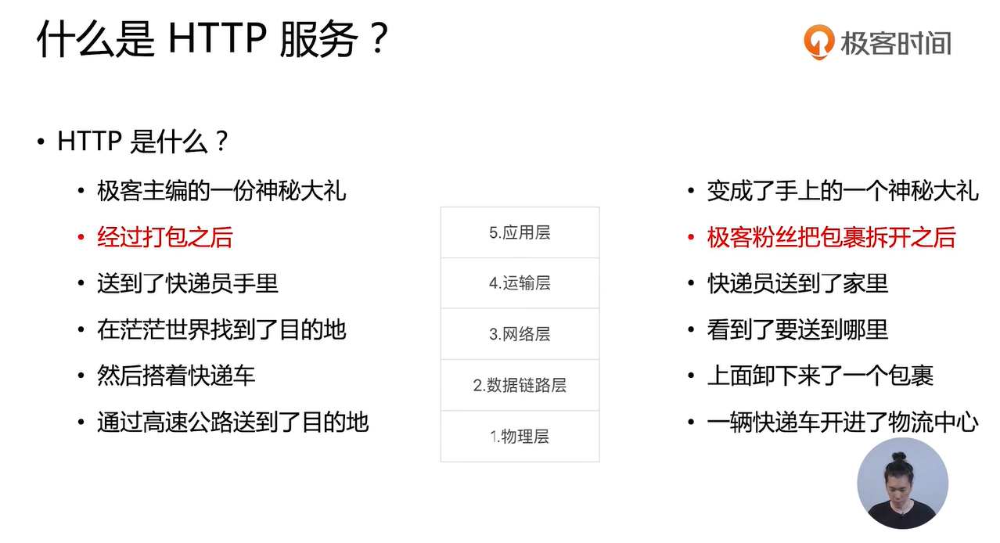

## HTTP服务


HTTP服务要做什么事情？
- 解析进来的HTTP请求报文
- 返回对应的HTTP返回报文


简单的HTTP服务器
``` js
const http = require('http')
const fs = require('fs')

http.createServer(function (req, res) {
    console.log('http://localhost:3000/')

    console.log(req.headers)
    

    res.writeHead(200)
    fs.createReadStream(__dirname+'/index.html')
        .pipe(res)

}).listen(3000)
```